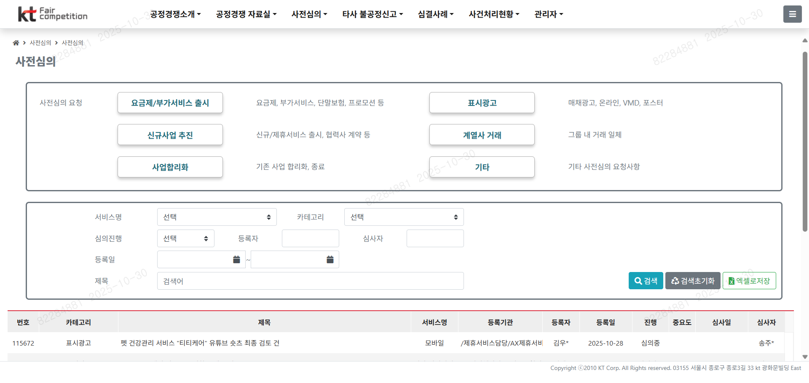
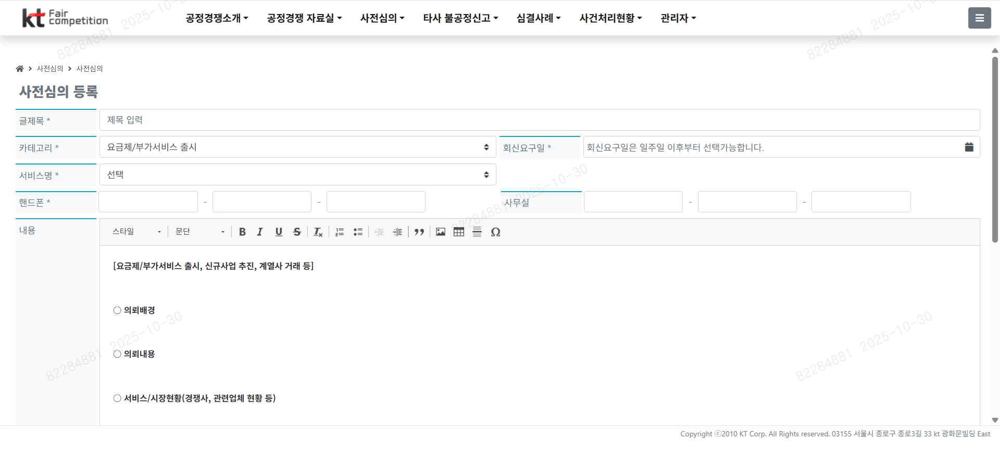
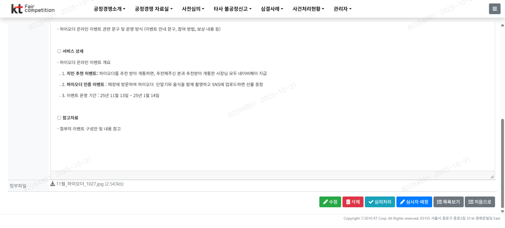

# RAG 기반 공정경쟁 사전심의 Agent

공정경쟁 사전심의 등록 시 관련 법령·유사 사례를 기반으로 심사결과(적합/보완필요/위반가능)를 자동 도출하여 심사 효율성과 일관성을 확보하는 AI 기반 솔루션

## 기획 의도

#### 기존 시스템

사전심의 등록 시 심사자 배정 후 담당자가 확인 후 심의처리 진행

#### 문제점
사용자가 사전심의 등록 후 심사자 배정 및 검토 후 심의처리까지 지연 발생

## 목표 및 기대 효과
카테고리별 관련 법령을 바탕으로 결과를 즉시 확인

| 구분              | 내용                          |
| --------------- | --------------------------- |
| **심사 효율화**      | 심의 처리 시간 단축 (평균 3일 → 즉시 확인) |
| **판단 일관성 확보**   | 법령·사례 기반 자동화로 주관적 판단 최소화    |
| **지식자산 축적**     | 심의사례·판례·보완내역 자동 축적 및 재활용    |
| **내부 감사 대응 용이** | 근거 데이터 기반 자동 로그 관리          |
| **신상품 출시 가속화**  | 사전심의 속도 향상으로 시장 대응력 제고      |

## 사용 기술
| 구분              | 기술                                | 역할                   |
| --------------- | --------------------------------- | -------------------- |
| **LLM (언어모델)**         | Azure OpenAI              | 자연어 이해, 판례 요약, 결과 생성 |
| **RAG 검색엔진**  | Azure AI Search                   | 관련 법령·유사사례를 벡터 기반으로 검색하여 LLM에 컨텍스트 제공  |
| **임베딩 생성기**    | Azure OpenAI Embeddings API     | 입력 문장 및 문서 임베딩화 (문맥 기반 벡터 표현)            | text-embedding-3-small |
| **UI/UX**       | Streamlit                | 심의 신청 및 결과 확인 인터페이스  |
| **백엔드/환경설정**   | Python + os.getenv()            | API 키, 엔드포인트, 배포명 등 환경변수 기반 보안 설정 |
| **배포환경**  | Azure Web App                     | 웹 서비스 배포             |

[RAG 기반 공정경쟁 사전심의 Agent](https://pro-song-webapp.azurewebsites.net/)
- [등록 예시](./fairEx.txt)

[공정경쟁 자율준수편람](./unfairGuide.pdf)

## 향후 확장 제안

파일(PDF/DOCX) 및 이미지 형태 업로드 분석으로 정확도 향상

사용자 권한(등록·검토) 기반 역할 분리 및 감사로그 강화

LangChain 기반 워크플로 확장 및 Fine-tuning으로 도메인 특화 성능 향상
